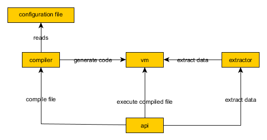

# xconfig
**xconfig** implements a C++ API together with utility programs for parsing configuration files.

**xconfig** configurations integrates closely with a UNIX type environment. Access to environment variables as well as access to output from UNIX commands is transparenly reflected in the configuration language. A C++ API together with a command line program are used for extracting data from configuration files.

Eventhough **xconfig** is a first cut implementation of an idea that needs many improvements it is useable as it stands right now. Several updates and extensions are planned. For example, a Python API mirroring the C++ API will be implemented. The configuration language will also be updated to transparently support sequences of repeated blocks of information.

# A small example

## Example 1
 

Type or copy/paste the following into **test1.cfg**:


```bash
namespace system{
  user = $USER                           # user from environment variable
  pwd = `pwd`                            # execute bash command - current work directory
  userathost = @"%{user}@`hostname`"     # string interpolation - concatenate variable with `hostname`
}
```

  

Print configuration using **xconfig**:

```bash
xconfig test1.cfg
```


The output is:
```bash
system_pwd="/home/user/hansewetz"
system_user="hansewetz"
system_userathost="hansewetz@dumbo"
```


A short explanation:
  * environment variables are accessed using 'dollar' notation
  * bash commands can be executed using 'backquote' notation
  * configuration variables are accessed using 'percentage' notation or directly by the name
  * environment variables, configuration variables and bash commands can be evaluated using string interpolation by prefixing the string with an 'at' sign (@)
  * names can be scoped using namespaces


## Example 2

The following example shows how to use the **xconfig** C++ API:
```C++
#include "xconfig/XConfig.h"
#include <iostream>
using namespace std;
using namespace xconfig;

int main(){
  // read and evaluate configuration file and print variables
  XConfig xfg("test1.cfg");
  for(auto&&[name,value]:xfg())cout<<name<<": "<<value<<endl;
}
```


To compile/link the program do:
```bash
g++ -o test1 test1.cc -m64 -fPIC -Wall -pedantic -Werror -std=c++2a -Wno-deprecated -Wno-register -D_GLIBCXX_USE_CXX11_ABI=0 -I<xconfig-install-path>/include -L<xconfig-install-path>/lib -lxconfigl
```


When running the program we get this output:
```bash
system.pwd: /home/user/hansewetz
system.user: hansewetz
system.userathost: hansewetz@dumbo
```


# Installation

These instructions will get you a copy of the project up and running on your local machine for development and testing purposes.

## Prerequisites
What things you need to install the software:
* [gcc](https://gcc.gnu.org/svn.html) supporting C++17 (tested with gcc 9.0 but should work with gcc 8.X)
* [cmake](https://cmake.org/download/) version 3.12.2 or higher
* [libboost_program_options.so](https://www.boost.org/doc/libs/1_58_0/more/getting_started/unix-variants.html) 1.57 or higher


<details>
  <summary>Installing gcc 9.x</summary>
  
If you don't have gcc 8 or 9 installed, you can pull the latest of trunc and compile it:
```bash
$>export INSTALLHOME=<your-installation-path>
$>
$># ------- install isl
$># download isl-isl-0.19
$>mkdir build && cd build
$>.././configure --prefix=${INSTALLHOME}
$>make && make check && make install
$>
$># ------- install gmp
$># download gmp-6.1
$>mkdir build && cd build
$>.././configure --prefix=${INSTALLHOME}
$>make && make check && make install
$>
$># ------- install mpfr
$># download mpfr-4.0.1
$>mkdir build && cd build
$>.././configure --prefix=${INSTALLHOME} --with-gmp=${INSTALLHOME}
$>make && make check && make install
$>
$># ------- install mpc
$># download mpc-1.1.0
$>mkdir build && cd build
$>.././configure --prefix=${INSTALLHOME} --with-gmp=${INSTALLHOME}
$>make && make check && make install
$>
$># ------- install gcc latest
$>mkdir gcc-trunk && cd gcc-trunk
$>svn checkout svn://gcc.gnu.org/svn/gcc/trunk .
$>mkdir build && cd build
$>././configure --prefix=${INSTALLHOME}   --with-isl-include=${INSTALLHOME}/include --with-isl-lib=${INSTALLHOME}/lib --disable-multilib --with-gmp=${INSTALLHOME} --with-mpfr=${INSTALLHOME} --with-mpc=${INSTALLHOME}
make && make check && make install
```
</details>

<details>
  <summary>Installing libboost_program_options.so.1.58.0</summary>
  
If you don't have **libboost_program_options** installed, please follow these instructions:
```bash
$># download boost v1.58 or higher
$>export INSTALLHOME=<your-installation-path>
$> ./bootstrap.sh --prefix=${INSTALLHOME} --with-libraries=program_options
$>./b2
$>./b2 install
```
</details>
  
<details>
  <summary>Installing cmake-3.12</summary>
  
If you don't have **cmake** version 3.12 or higher installed, please follow these instructions:
```bash
$># download cmake-3.12.2 or higher
$>export INSTALLHOME=<your-installation-path>
$>mkdir build && cd build
$>cmake -DCMAKE_INSTALL_PREFIX=${INSTALLHOME} ..
$>make && make install
```
</details>


## Installing xconfig
  
Step by step recipie for compiling and installing **xconfig** (assuming gcc 9.x, cmake 3.12, libboost_program_options.so are installed):
```bash
$>mkdir xconfig && cd xconfig
$>git clone https://github.com/hansewetz/xconfig.git .
$>mkdir build && cd build
$>export CXX=<full path to g++ compiler>            # /usr/bin/g++
$>export CC=<full path to gcc compiler>             # /usr/bin/gcc
$>cmake -DCMAKE_INSTALL_PREFIX=<install-path> ..
$>make && make install
```

The installation directory is populated with:
```bash
.
├── ...
├── <install-path>
│   ├── bin                    # xconfig binaries
│   ├── lib                    # xconfig libraries
│   ├── include                # xconfig C++ header files
│   ├── examples               # sample programs
└── ...
```

# Versioning

<p>
The version of the <b>xconfig</b> API  is located in the <code>xconfig/version.h</code> header file. The version is specified through two <code>int</code> C++ variables:
</p>

<ul>
  <li><code>constexpr const static int XCONFIG_VERSION_MAJOR</code></li>
  <li><code>constexpr const static int XCONFIG_VERSION_MINOR</code></li>
</ul>
<p>
You can print the version of the current installation by executing: <code>xconfig --version</code>.
</p>

# In depth: language, API and design

## Language

<p>
The language follows a C like style where variable names consists of alphanumeric characters including the underscore character.
Variables can be assigned string or integer values:

<pre class="brush: bash">
user = "hansewetz"             # 'user' is a string
maxthread = 20                 # 'maxthreads' is an integer
</pre>
</p>

<p>
Environment variables are accessed using a <b>bash</b> style notation:
<pre class="brush: bash">
user = ${USER}             # 'user' is assigned the value of environment variable 'USER'
user1 = $USER              # works without braces also
</pre>
</p>

<p>
Normal variables are accessed by dircetly using their name or by prefixing them with '%':
<pre class="brush: bash">
user = @"${USER}"                        # 'user' is assigned the value of environment variable 'USER'
userAtMachine= @"%{user}@`hostname -i`"  # access variable 'USER' inside a string
</pre>
</p>

<p>
Commands can be executed by enclosing the the command inside back-quotes:
<pre class="brush: bash">
machine = `hostname`   # get name of machine
</pre>
</p>


<p>
The <i>plus</i> operator concatenate strings and adds integers:
<pre class="brush: bash">
user = "hans"+"ewetz"         # user = "hansewetz"
minthreads = 10
maxthreads = minthreads + 8   # maxthreads = 18
</pre>
</p>

<p>
An expression on the right hand side of the assignment operator can access a variable using <i>dot</i> separated namespaces:
<pre class="brush: bash">
namespace system{
  user = $USER                     # user = "hansewetz"
  machine = `hostname -i`          # machine = "10.0.0.4"
}
userAtMachine = @"%{system.user}@%{system.machine}"   # userAtMachine = "hansewetz@10.0.0.4"
</pre>
</p>

<p>
As the previous example showed strings can be interpolated.
During interpolation environment variable, normal variables as well as commands are interpolated.
A variation of the previous example is shown here:
<pre class="brush: bash">
namespace system{
  user = @"$USER"                  # hansewetz
  machine = `hostname -i`          # machine = "10.0.0.4"
}
userAtMachine = @"%{system.user}@%{system.machine}"   # userAtMachine = "hansewetz@10.0.0.4"
</pre>
</p>

<p>
There are some restrictions to how variables can be used.
A variable cannot be assigned to once it has a value.
Neither can a namespace qualified variable be used on the left hand side of the assignment operator.
</p>


## API

Not yet done


## Design

<p>
The design is relatively straight forward:
<ul>
  <li><b>bison</b>/<b>flex</b> is used for parsing the configuration</li>
  <li>during parsing write opcodes for a <i>virtual machine</i></li>
  <li>execute the opcodes with the virtual machine</li>
  <li>use an <i>extractor</i> to retrieve data from the memory of the virtual machine</li>
</ul>
</p>

<p>
An overview of the design is shown here:
  


</p>


<p>
The <i>virtual machine</i> is implemented as a simple stack machine tailored specifically for this project.
The name of the virtual machine is MMVM - <i>Mickey Mouse Virtual Machine</i>.
The MMVM currently supports 13 opcodes.
Among them are simple operation such as 'push value on stack' or 'store value in memory'.
More complex operations such as 'evaluate a command in a shell and store output on stack' are also supported.
</p>

<p>
One might wonder if it is not overkill to implement a VM just for parsing a configuration file.
As it turns out, having a VM available makes it almost effortless to support and experiment with new features in the configuration language.
Since the MMVM implementation is only around 330 lines of C++ code it can be implemented in only a few hours.
</p>

<p>
The MMVM currently supports <b>string</b>s and <b>int</b>egers.
The support is not extensive. Two integers can be added, two strings can be concatenated and integers can be added.
</p>

<p>
Evaluation of a configuration file is done in two steps:
<ul>
  <li>compile the file into a program(generate a program consisting of op codes for MMVM)</li>
  <li>execute program (sequence of opcodes</li>
</ul>
</p>

<p>
Namespaces are used to scope variables.
The full name of a variable is a series of <i>dot</i> separated namespaces followed by the name of the variable.
It is not necessary to use the full name of a variable.
When namespaces are left out, the compiler looks for the variable in the enclosing scope(s) .
For example:
</p>

<p>
<pre class="brush: bash">
# test1.cfg
a = 18
namespace ns{
  namespace ns1{
    b = 19
    namespace ns2{
      c = b       # 'b' is found one step up
      d = ns1.b   # same as previous
      e = a       # 'a' is found in outer most scope
    }
  }
}
</pre>
</p>

<p>
The output from executing: <b>xconfig test1.cfg</b>:
</p>

<p>
<pre class="brush: bash">
a="18"
ns_ns1_b="19"
ns_ns1_ns2_c="19"
ns_ns1_ns2_d="19"
ns_ns1_ns2_e="18"
</pre>
</p>


<p>
When interpolating strings I would like to be able to handle namespaces the same way as they are handled when referencing variables outside string interpolation.
In order to reference variables without specifying the full namespace path, we need a table that contains information about the location of a variables within namespaces.
This is done by building the table at compilation time and using it at runtime during string interpolation.
</p>


# Development

<p>
The following is planned:
* add git commit SHA to 'version.h' file (via cmake)
* implement Python based API
* extend language to support repeated groups of structurally similar blocks of definitions
* better/more documentation
* possibly - port to lower version of gcc (i.e. C++11)
</p>

  
# License
This project is licensed under the MIT License - see the [LICENSE.md](https://choosealicense.com/licenses/mit/) file for details

# Authors, emails, blogs etc.
* author: Hans Ewetz
* email: hansewetz@hotmail.com
* blog: https://hansewetz.blogspot.com


